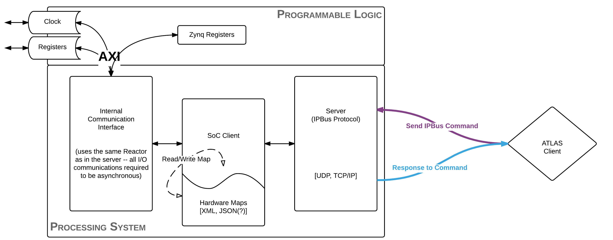
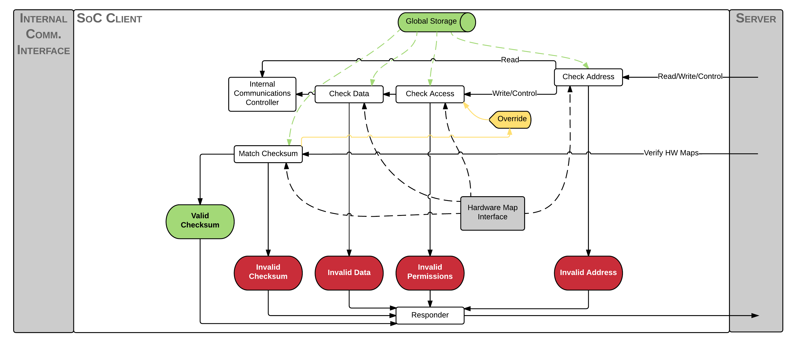
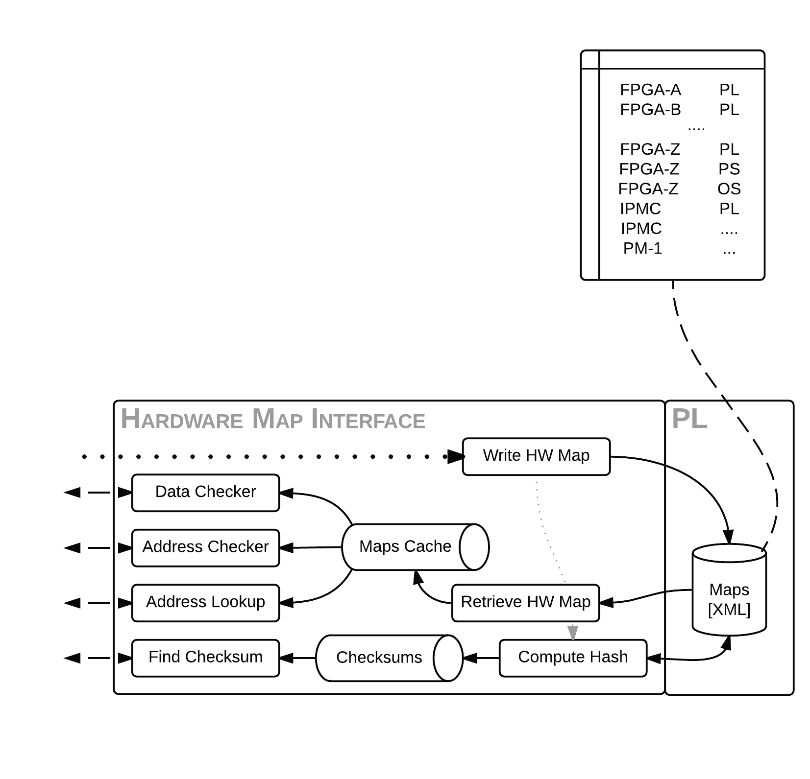
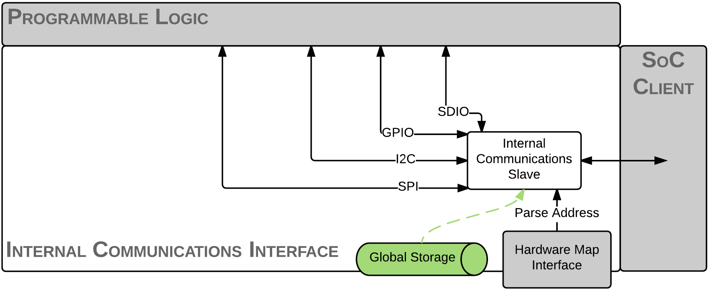

Background
==========

Ironman is a software infrastructure that will standardize communication protocols on chips with embedded processors. In particular, this was written for use in L1Calo with IPBus, but was written to maintain modularity and flexibility to evolve with changing needs.

To explain this approach, we first started with our vision for the software with an overview. Below, we explain each part in more detail.

Goals
-----

We make it as easy as possible for *anyone* to put their pieces in to the general framework while maintaining the overall procedure. This software will

    - provide a wide array of standard networking protocols for reading and writing packets
    - allow for implementation of **custom communication protocols** for reading and writing the various hardware components
    - allow for definition of **custom hardware maps** which specify the layout of the entire board
    - use a single-threaded **reactor** model, an event-driven model, which is a global loop that fires listeners when certain events have triggered

Overview
--------

An external client, such as a human or a monkey, is tasked with the job of communicating a transaction request or a status query of a piece of hardware (*ATLAS Client*). This is sent, for example, as an IPBus command to the board running **ironman** software. This request is received by a server actively listening and then dispatches this request to the System-on-Chip client. The System-on-Chip client is made self-aware using hardware definitions and dispatches this request along a callback chain to the Internal Communications Interface. It is at this point that the software handles the customized communication to fulfill the request of the biological being controling the ATLAS Client. After this, the response is formed, transferred back to the server who will transmit the information back to the client.

Server
~~~~~~

.. image:: images/ironman.diagram.server.png

The server has a few jobs to do upon receipt of a packet. As the server is actively listening, it is going to plug itself into the reactor and kick off the callback chain for us (known as *deferreds* or *promises*).

The server knows the format of the packet entirely and will unpack the data into a Request Packet Object that will be used by the rest of the software. It is at this point that a few checks are done, such as checking that the data *can* be unpacked as well as making sure the headers are valid.

If the basic sanity checks look good, then it must decide what to do with the packet. If the request requires communication with the hardware, then it will pass along the packet to the SoC Client to dispatch the request. If it simply requires information about the history of packets sent (such as a Resend Packet), then it will return the packets it records in history.

This leads to the other part of the server which is to maintain a log of all inbound/request and outbound/response packets. It is at this point which the board communicates with the outside world and makes it a suitable place to implement the history recording.

For those who are more familiar or learn better with some code::

    from ironman.server import ServerFactory
    from ironman.packet import IPBusPacket
    from twisted.internet import reactor
    from twisted.internet.defer import Deferred

    # listen for IPBus packets over UDP at port 8888
    reactor.listenUDP(8888, ServerFactory('UDP',
        lambda: Deferred().addCallback(IPBusPacket)
        )
    )

    # listen for IPBus packets over TCP at port 8889
    reactor.listenTCP(8889, ServerFactory('TCP',
        lambda: Deferred().addCallback(IPBusPacket)
        )
    )

    # start the global loop
    reactor.run()

Client
~~~~~~

The job of the client here is to analyze the packet more thoroughly. If the client is handling the packet, then it must be a request packet. It will then communicate with the Hardware Interface to determine whether or not the transaction packet is good: valid address, valid permissions, valid data. If all of these things pass, it then passes the packet along to the Internal Communications which will build up a response.

It should be noted that the client is not allowed to modify the response packet at all. Only the Server and the Internal Communications are allowed to do this.

Hardware Interface
~~~~~~~~~~~~~~~~~~

The job of the Hardware Interface is to parse the hardware definitions transferred to the board and build up a cached, global mapping of address to properties about the address. In Python terminology, this is a giant dictionary. It must assess that a single address is not taken up by two different hardware definitions (no conflicts) and that the hardware map is parseable and valid (the latter has yet to be defined yet). It will also provide a way to compute the checksum of the hardware map files to ensure that the board is running on the same definitions that the monkey has communicated to the board with.

Internal Communications
~~~~~~~~~~~~~~~~~~~~~~~

Lastly, the Internal Communications is primarily custom code written by the developers to do exactly that: communicate with the board. Depending on how the board is set up, there may be a virtual filesystem or raw pointers or custom drivers that the code will need to access. Since this is something that will vary on a board-by-board basis, we leave most of this code up to the user and only provide a few simple cases for file reading and writing.

